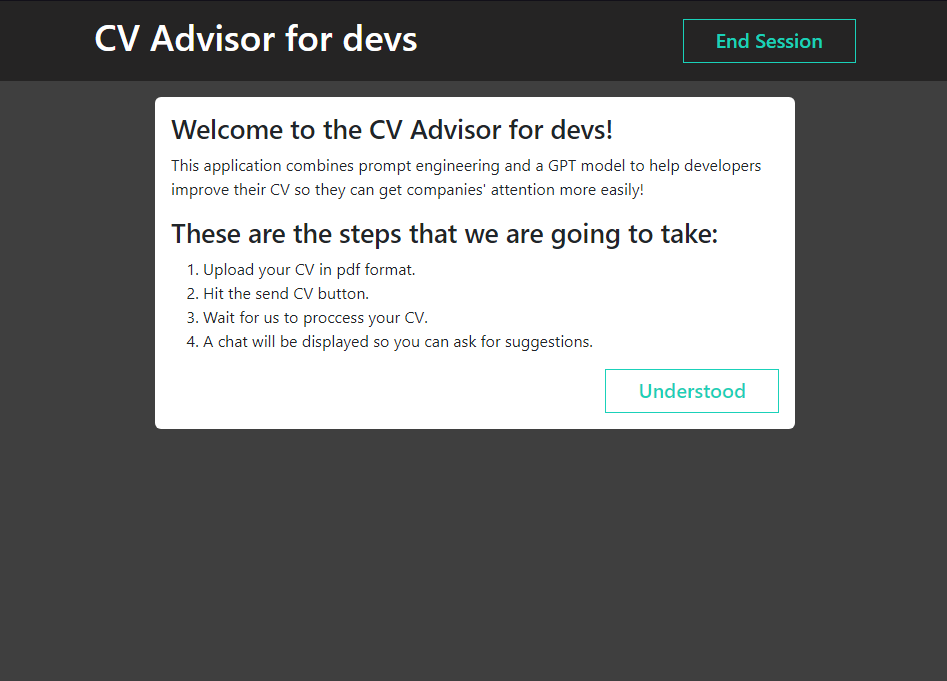
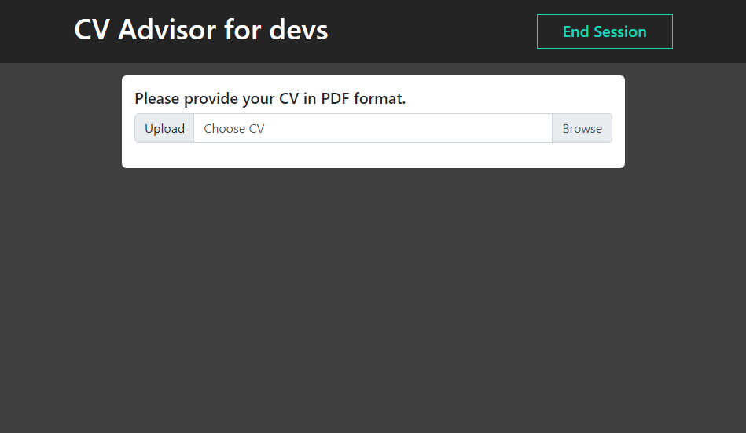
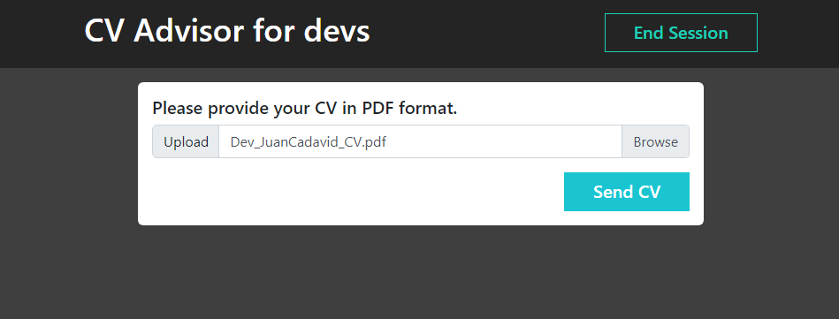
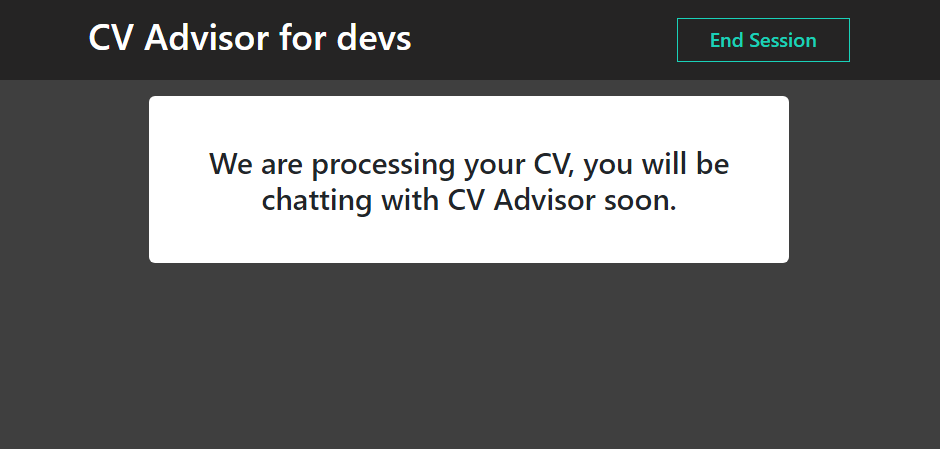
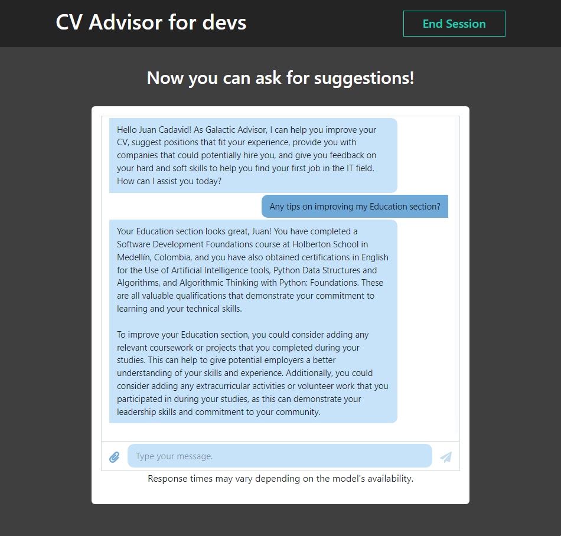

# CV Advisor for Junior Developers 🚀

This project's goal is to help junior developers improve their CVs so they can attract new opporunities
more easily!
By combining prompt engineering and the GPT3.5 model, this application provides developers with valuable
tips, and suggestions on how to make their CVs more attractive to recruiters.

## These are the different views displayed by the application:

- Initial page, where the user is given information about the app's functionality.

- After clicking the Understood button, you will be prompted to upload your CV, and the backend will extract
  all the information in it, for the GPT model to process.

- After your CV is processed, the GPT model will be prompted to analyze the information inside it, so it can
  provide you with valuable insights.

- Finally, a chat will be displayed for you to ask questions based on the information inside your CV.

### About the tech stack:

- Frontend was built using React
- The [backend](https://github.com/Juansu01/CV-Advisor-GPT-BackEnd) is a simple REST API built with Flask
